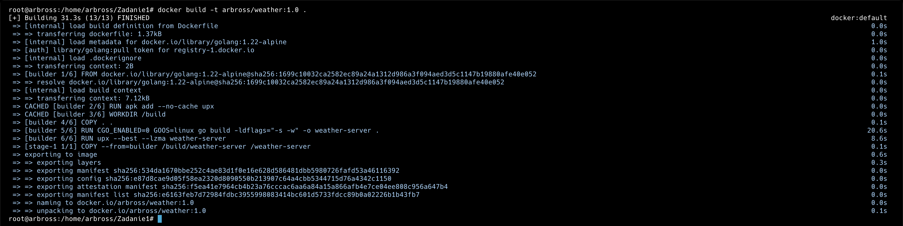
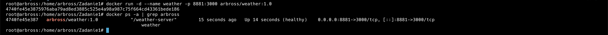
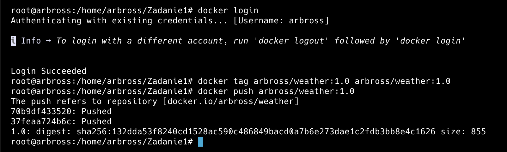
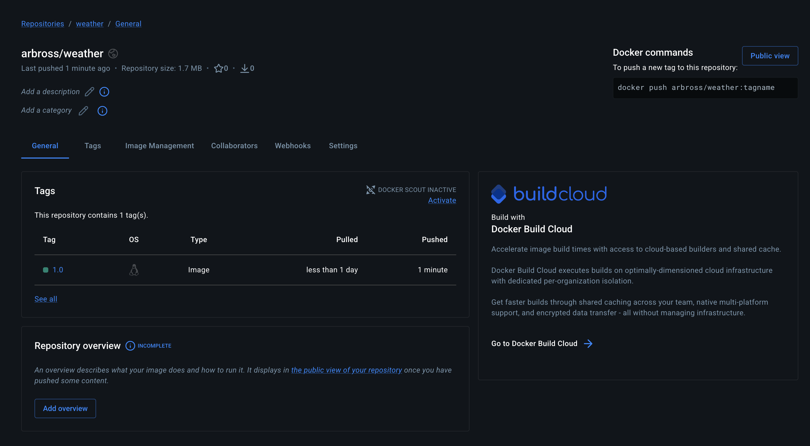
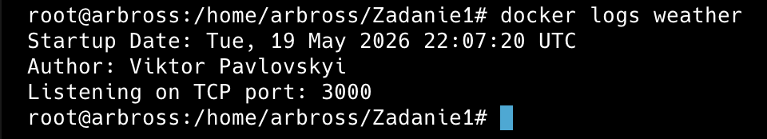
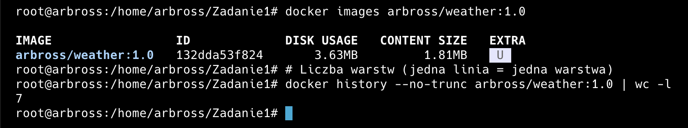

## 1. Aplikacja pogodowa

Aplikacja została napisana w języku **Go**. Po uruchomieniu wyświetla w logach datę startu, imię i nazwisko autora oraz numer portu TCP, na którym nasłuchuje. Użytkownik może wybrać kraj i miasto z predefiniowanej listy, a następnie uzyskać aktualne dane pogodowe (temperatura, wilgotność, wiatr, ciśnienie, opady, warunki) pobierane z publicznego API **Open-Meteo**.

## 2. Polecenia Docker

### a) Zbudowanie obrazu

```bash
docker build -t arbross/weather:1.0 .
```

### b) Uruchomienie kontenera

Mapowanie portu **8881** na hoście na port **3000** w kontenerze:

```bash
docker run -d --name weather -p 8881:3000 arbross/weather:1.0
```

### c) Podgląd logów aplikacji (wymaganie z punktu 1a)

```bash
docker logs weather
```

**Przykładowe wyjście:**

```
Startup Date: Mon, 19 May 2025 22:10:00 UTC
Author: Viktor Pavlovskyi
Listening on TCP port: 3000
```

### d) Informacje o obrazie – warstwy i rozmiar

**Rozmiar obrazu:**

```bash
docker images arbross/weather:1.0
```

**Historia warstw (layers):**

```bash
docker history arbross/weather:1.0
```

> Ze względu na użycie `scratch` oraz jedną instrukcję `COPY`, końcowy obraz zawiera wyłącznie pojedynczą, bardzo małą warstwę z skompresowanym plikiem wykonywalnym.

## 3. Zrzuty ekranu

| Opis | Podgląd |
|------|---------|
| Budowanie obrazu (`docker build`) |  |
| Uruchomienie kontenera (`docker run`) |  |
| Repozytorium na Docker Hub |  |
| Podgląd obrazu na Docker Hub (web) |  |
| Informacje o obrazie (`docker images`) |  |
| Liczba warstw i rozmiar |  |

## 4. Dostęp do aplikacji

Po uruchomieniu kontenera aplikacja jest dostępna pod adresem:

```
http://localhost:8881
```

Widok pozwala wybrać kraj i miasto, a następnie wyświetla aktualne dane meteorologiczne pobrane z Open-Meteo.

## 5. Docker Hub

[Adres URL na Docker Hub z obrazem](https://hub.docker.com/r/arbross/weather)
